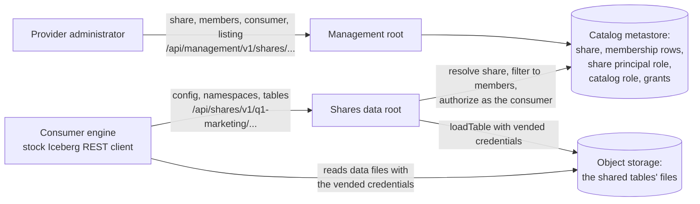

<!-- promoted: receipt pr-96c605dc · public-id shares-journeys-96c605dc · exported 2026-09-04 · license Apache-2.0 · body-sha256 8321582d3cc15f3f72b0a1aa610777c174a392952d0968b42e9c52744b3b4fc6
     source: a private provenance chain (opaque; the mapping lives with the source). Corrections arrive as
     new versions that supersede; history is never rewritten. -->

# Polaris shares: end-to-end journeys under each combination of design choices

Companion to the Polaris shares design proposal (work in progress). Where the design proposal holds the decisions and their rationale, this document holds the look-and-feel: for each plausible combination of the choices that change URLs, the complete provider journey and consumer journey as concrete method-and-path rows with illustrative payloads. Payload shapes that do not vary are defined once in "Payload shapes" and named in the tables.

## The choices that change paths

| Axis | Option | Effect on paths |
|---|---|---|
| D14 control-plane root | (i) `/api/shares/v1` · (ii) `/api/management/v1` | where every provider call starts |
| D13 share addressing | (a) top-level `/shares/{share}` (bound to one catalog by rule in v1) · (b) nested `/catalogs/{catalog}/shares/{share}` | the provider's share paths and whether the body carries `catalogName` |
| D5 data root | (a) shared: `/api/catalog` with a reserved prefix `system$share$<share>` · (b) distinct: `/api/shares` (or `/api/shares/v1/data` when D14 is (i)) | the consumer's base URL, `warehouse` and `prefix` |
| Prefix keying | by share · by listing | the `warehouse` and `prefix` values the consumer uses |

Choices that do not change any path: D2 (how the share is stored), D6 (client credentials in v1), D9 (owner), D12 (aliasing deferred), D15 to D17 (create-path scaffolding, membership storage, binding step).

## The journeys compared

J1 is the recommended combination. Each journey after it differs from a neighbor in exactly one axis: J2, J3 and J4 each change one choice of J1 (the data root, the prefix keying, the share addressing); J5 changes J4's control-plane root; J6 changes J5's data root.

| Journey | D14 control-plane root | D13 share addressing | D5 data root | Prefix keying |
|---|---|---|---|---|
| J1 | (ii) `/api/management/v1` | (a) top-level | (b) `/api/shares` | share |
| J2 | (ii) `/api/management/v1` | (a) top-level | (a) `/api/catalog` + reserved prefix | share |
| J3 | (ii) `/api/management/v1` | (a) top-level | (b) `/api/shares` | listing |
| J4 | (ii) `/api/management/v1` | (b) nested | (b) `/api/shares` | share |
| J5 | (i) `/api/shares/v1` | (b) nested | (b) `/api/shares/v1/data` | share |
| J6 | (i) `/api/shares/v1` | (b) nested | (a) `/api/catalog` + reserved prefix | share |

Running example throughout: provider catalog `sales`, share `q1-marketing` with tables `marketing.campaigns` and `marketing.spend_by_region`, consumer `beta-corp`, listing `beta-corp-q1`, realm `acme`, host `polaris.example.com`.

## The two surfaces at a glance (J1)

The provider never touches the data root and the consumer never touches the management root; both roots read the same metastore, and the consumer's storage access is the ordinary vended credential, scoped to the shared tables.

## Payload shapes (invariant across journeys unless noted)

- CreateShare: `{ "share": { "name": "q1-marketing", "catalogName": "sales", "description": "FY26 Q1 marketing aggregates" } }` (under D13 (b) `catalogName` must match the path).
- UpdateShareMembers: `{ "currentEntityVersion": 1, "updates": [ { "action": "ADD", "member": { "kind": "TABLE", "canonical": { "namespace": ["marketing"], "name": "campaigns" } } }, { "action": "ADD", "member": { "kind": "TABLE", "canonical": { "namespace": ["marketing"], "name": "spend_by_region" } } } ] }` (under D13 (a) a member may also carry `"catalog": "sales"`, which must equal the bound catalog in v1).
- CreateExternalConsumer: `{ "externalConsumer": { "name": "beta-corp", "description": "Beta Corp analytics" } }`.
- CreateConsumerCredential: `{}`; response `201 { "credentialId": "c1", "clientId": "…", "clientSecret": "…", "status": "ACTIVE" }` (the secret appears exactly once).
- CreateListing: `{ "name": "beta-corp-q1", "consumerName": "beta-corp" }`.
- EndpointConfig response: `{ "catalogEndpoint": <data root>, "warehouse": <warehouse>, "oauth2ServerUri": "https://polaris.example.com/api/catalog/v1/oauth/tokens", "scope": "PRINCIPAL_ROLE:ALL", "additionalHeaders": { "Polaris-Realm": "acme" } }`; the two placeholders are the only journey-dependent values.
- Token request (every journey): `POST {oauth2ServerUri}` with `grant_type=client_credentials&client_id=…&client_secret=…&scope=PRINCIPAL_ROLE:ALL` and header `Polaris-Realm: acme`; response `{ "access_token": "…", "token_type": "bearer", "expires_in": 3600 }`. The token endpoint is the deployment's; Polaris's in-server one is deprecated upstream and shown only as the default.
- ConfigResponse: `{ "overrides": { "prefix": <prefix> }, "defaults": {}, "endpoints": [ "GET /v1/{prefix}/namespaces", "GET /v1/{prefix}/namespaces/{namespace}", "GET /v1/{prefix}/namespaces/{namespace}/tables", "GET /v1/{prefix}/namespaces/{namespace}/tables/{table}", "GET /v1/{prefix}/namespaces/{namespace}/tables/{table}/credentials", "POST /v1/{prefix}/namespaces/{namespace}/tables/{table}/metrics" ] }`.
- LoadTableResult (every journey): `{ "metadata-location": "s3://acme-marketing/campaigns/metadata/00012.metadata.json", "metadata": { … }, "storage-credentials": [ { "prefix": "s3://acme-marketing/campaigns/", "config": { … short-lived, read-only … } } ] }` when the request carries `X-Iceberg-Access-Delegation: vended-credentials`.

## J1: management root, top-level shares, distinct data root, keyed by share

Choices: D14 (ii) `/api/management/v1` · D13 (a) top-level · D5 (b) `/api/shares` · prefix keyed by share.

| Step | Call | Payload / result |
|---|---|---|
| P1 Enable | deployment configuration `ENABLE_SHARES=true` | no API |
| P2 Create share | `POST /api/management/v1/shares` | CreateShare (`catalogName` binds the one catalog; the share principal role and the catalog role in `sales` are created here) |
| P3 Add members | `POST /api/management/v1/shares/q1-marketing/members` | UpdateShareMembers (a member outside `sales` is rejected with `400` in v1) |
| P4 Create consumer | `POST /api/management/v1/external-consumers` | CreateExternalConsumer |
| P5 Mint credential | `POST /api/management/v1/external-consumers/beta-corp/credentials` | CreateConsumerCredential |
| P6 Create listing | `POST /api/management/v1/shares/q1-marketing/listings` | CreateListing (grants the consumer usage of the share principal role) |
| P7 Read endpoint config | `GET /api/management/v1/shares/q1-marketing/listings/beta-corp-q1/endpoint-config` | EndpointConfig with `catalogEndpoint = https://polaris.example.com/api/shares`, `warehouse = q1-marketing` |
| C1 Token | `POST https://polaris.example.com/api/catalog/v1/oauth/tokens` | Token request |
| C2 Config | `GET /api/shares/v1/config?warehouse=q1-marketing` | ConfigResponse with `prefix = q1-marketing` |
| C3 List namespaces | `GET /api/shares/v1/q1-marketing/namespaces` | `{ "namespaces": [["marketing"]] }` |
| C4 List tables | `GET /api/shares/v1/q1-marketing/namespaces/marketing/tables` | `{ "identifiers": [ {"namespace":["marketing"],"name":"campaigns"}, {"namespace":["marketing"],"name":"spend_by_region"} ] }` (members only) |
| C5 Load table | `GET /api/shares/v1/q1-marketing/namespaces/marketing/tables/campaigns` + delegation header | LoadTableResult |
| C6 Refresh credentials | `GET /api/shares/v1/q1-marketing/namespaces/marketing/tables/campaigns/credentials` | `{ "storage-credentials": [ … ] }` |
| C7 Write attempt | `POST /api/shares/v1/q1-marketing/namespaces/marketing/tables` | `404` (route not mounted) |
| C8 Non-member | `GET /api/shares/v1/q1-marketing/namespaces/marketing/tables/internal_costs` | `404 NoSuchTableException` |
| L1 Remove member | `POST /api/management/v1/shares/q1-marketing/members` with `{"action":"REMOVE",…}` | member gone from every consumer's view |
| L2 Delete listing | `DELETE /api/management/v1/shares/q1-marketing/listings/beta-corp-q1` | `204`; Beta Corp's next call fails |
| L3 Rotate credential | `POST /api/management/v1/external-consumers/beta-corp/credentials/c1/rotate` | new pair; old valid for the service-defined overlap |
| L4 Delete consumer | `DELETE /api/management/v1/external-consumers/beta-corp` | `204`; listings and credentials gone |
| L5 Delete share | `DELETE /api/management/v1/shares/q1-marketing` | `204`; every listing revoked; the catalog role and principal role are dropped with it |

The two roots read as siblings: `/api/management/v1/…` beside `/api/catalog/v1/…` for the provider's ordinary work, and `/api/shares/v1/…` beside `/api/catalog/v1/…` for the consumer.

## J2: management root, top-level shares, shared data root, keyed by share

Choices: D14 (ii) `/api/management/v1` · D13 (a) top-level · D5 (a) `/api/catalog` with the reserved prefix · prefix keyed by share.

Provider rows P1 to P6 and lifecycle rows L1 to L5 are identical to J1. What changes:

| Step | Call | Payload / result |
|---|---|---|
| P7 Read endpoint config | as J1 | EndpointConfig with `catalogEndpoint = https://polaris.example.com/api/catalog`, `warehouse = system$share$q1-marketing` |
| C2 Config | `GET /api/catalog/v1/config?warehouse=system$share$q1-marketing` | ConfigResponse with `prefix = system$share$q1-marketing`, `defaults = {}` (catalog properties scrubbed) |
| C3 List namespaces | `GET /api/catalog/v1/system$share$q1-marketing/namespaces` | as J1 |
| C4 List tables | `GET /api/catalog/v1/system$share$q1-marketing/namespaces/marketing/tables` | as J1 (filtered to members) |
| C5 Load table | `GET /api/catalog/v1/system$share$q1-marketing/namespaces/marketing/tables/campaigns` + delegation header | LoadTableResult |
| C6 Refresh credentials | `GET /api/catalog/v1/system$share$q1-marketing/…/tables/campaigns/credentials` | as J1 |
| C7 Write attempt | `POST /api/catalog/v1/system$share$q1-marketing/namespaces/marketing/tables` | refused by the share request filter before any handler (`404`, read-only surface) |
| C8 Non-member | `GET /api/catalog/v1/system$share$q1-marketing/namespaces/marketing/tables/internal_costs` | `404`, forbidden masked as not found |

What the consumer sees that J1 hides: the reserved internal name `system$share$q1-marketing` in every URL.

## J3: management root, top-level shares, distinct data root, keyed by listing

Choices: D14 (ii) `/api/management/v1` · D13 (a) top-level · D5 (b) `/api/shares` · prefix keyed by listing.

Provider rows are identical to J1. What changes:

| Step | Call | Payload / result |
|---|---|---|
| P7 Read endpoint config | as J1 | EndpointConfig with `warehouse = beta-corp-q1` (the listing) |
| C2 Config | `GET /api/shares/v1/config?warehouse=beta-corp-q1` | ConfigResponse with `prefix = beta-corp-q1` |
| C3 to C8 | `/api/shares/v1/beta-corp-q1/namespaces/…` | as J1, under the listing's prefix |
| L2 Delete listing | as J1 | Beta Corp's URLs stop working; other consumers' prefixes on the same share are untouched |

A second consumer on the same share gets its own prefix (`/api/shares/v1/gamma-inc-q1/…`); under J1 both consumers use `/api/shares/v1/q1-marketing/…` and are told apart by identity.

## J4: management root, catalog-nested shares, distinct data root, keyed by share

Choices: D14 (ii) `/api/management/v1` · D13 (b) nested · D5 (b) `/api/shares` · prefix keyed by share.

Consumer rows are identical to J1. What changes on the provider side:

| Step | Call |
|---|---|
| P2 Create share | `POST /api/management/v1/catalogs/sales/shares` |
| P3 Add members | `POST /api/management/v1/catalogs/sales/shares/q1-marketing/members` |
| P6 Create listing | `POST /api/management/v1/catalogs/sales/shares/q1-marketing/listings` |
| P7 Read endpoint config | `GET /api/management/v1/catalogs/sales/shares/q1-marketing/listings/beta-corp-q1/endpoint-config` |
| L1, L2, L5 | the same paths with `/catalogs/sales/` before `/shares` |

This is the shape of the existing management API's nesting (`/catalogs/{catalog}/catalog-roles`), and it is the one that hard-codes the one-catalog rule into every path.

## J5: shares root, catalog-nested shares, distinct data root, keyed by share

Choices: D14 (i) `/api/shares/v1` · D13 (b) nested · D5 (b) `/api/shares/v1/data` · prefix keyed by share.

| Step | Call | Payload / result |
|---|---|---|
| P1 Enable | deployment configuration `ENABLE_SHARES=true` | no API |
| P2 Create share | `POST /api/shares/v1/catalogs/sales/shares` | CreateShare |
| P3 Add members | `POST /api/shares/v1/catalogs/sales/shares/q1-marketing/members` | UpdateShareMembers |
| P4 Create consumer | `POST /api/shares/v1/external-consumers` | CreateExternalConsumer |
| P5 Mint credential | `POST /api/shares/v1/external-consumers/beta-corp/credentials` | CreateConsumerCredential |
| P6 Create listing | `POST /api/shares/v1/catalogs/sales/shares/q1-marketing/listings` | CreateListing |
| P7 Read endpoint config | `GET /api/shares/v1/catalogs/sales/shares/q1-marketing/listings/beta-corp-q1/endpoint-config` | EndpointConfig with `catalogEndpoint = https://polaris.example.com/api/shares/v1/data`, `warehouse = q1-marketing` |
| C1 Token | `POST https://polaris.example.com/api/catalog/v1/oauth/tokens` | Token request |
| C2 Config | `GET /api/shares/v1/data/v1/config?warehouse=q1-marketing` | ConfigResponse with `prefix = q1-marketing` |
| C3 List namespaces | `GET /api/shares/v1/data/v1/q1-marketing/namespaces` | `{ "namespaces": [["marketing"]] }` |
| C4 List tables | `GET /api/shares/v1/data/v1/q1-marketing/namespaces/marketing/tables` | members only |
| C5 Load table | `GET /api/shares/v1/data/v1/q1-marketing/namespaces/marketing/tables/campaigns` + delegation header | LoadTableResult |
| C6 Refresh credentials | `GET /api/shares/v1/data/v1/q1-marketing/namespaces/marketing/tables/campaigns/credentials` | `{ "storage-credentials": [ … ] }` |
| C7 Write attempt | `POST /api/shares/v1/data/v1/q1-marketing/namespaces/marketing/tables` | `404` (route not mounted) |
| C8 Non-member | `GET …/namespaces/marketing/tables/internal_costs` | `404 NoSuchTableException` |
| L1 Remove member | `POST …/shares/q1-marketing/members` with `{"action":"REMOVE",…}` | member gone from every consumer's view |
| L2 Delete listing | `DELETE /api/shares/v1/catalogs/sales/shares/q1-marketing/listings/beta-corp-q1` | `204`; Beta Corp's next call fails |
| L3 Rotate credential | `POST /api/shares/v1/external-consumers/beta-corp/credentials/c1/rotate` | new pair; old valid for the service-defined overlap |
| L4 Delete consumer | `DELETE /api/shares/v1/external-consumers/beta-corp` | `204`; listings and credentials gone |
| L5 Delete share | `DELETE /api/shares/v1/catalogs/sales/shares/q1-marketing` | `204`; every listing revoked |

The consumer's base URL carries the version token twice, once for the shares API and once for the Iceberg protocol, because the management API owns `/api/shares/v1` in this combination.

## J6: shares root, catalog-nested shares, shared data root, keyed by share

Choices: D14 (i) `/api/shares/v1` · D13 (b) nested · D5 (a) `/api/catalog` with the reserved prefix · prefix keyed by share.

Provider rows P1 to P6 and lifecycle rows L1 to L5 are identical to J5. The consumer rows are those of J2: `catalogEndpoint = https://polaris.example.com/api/catalog`, `warehouse = system$share$q1-marketing`, every consumer URL under `/api/catalog/v1/system$share$q1-marketing/…`, writes refused by the filter, forbidden masked as not found, and the reserved internal name visible in every consumer URL.

## Reading the six side by side

| | J1 | J2 | J3 | J4 | J5 | J6 |
|---|---|---|---|---|---|---|
| Provider root | `/api/management/v1` | `/api/management/v1` | `/api/management/v1` | `/api/management/v1` | `/api/shares/v1` | `/api/shares/v1` |
| Share path | `/shares/q1-marketing` | same | same | `/catalogs/sales/shares/q1-marketing` | same | same |
| Consumer base URL | `/api/shares` | `/api/catalog` | `/api/shares` | `/api/shares` | `/api/shares/v1/data` | `/api/catalog` |
| `warehouse` and `prefix` | `q1-marketing` | `system$share$q1-marketing` | `beta-corp-q1` | `q1-marketing` | `q1-marketing` | `system$share$q1-marketing` |
| Consumer table URL | `/api/shares/v1/q1-marketing/namespaces/marketing/tables/campaigns` | `/api/catalog/v1/system$share$q1-marketing/namespaces/marketing/tables/campaigns` | `/api/shares/v1/beta-corp-q1/namespaces/marketing/tables/campaigns` | as J1 | `/api/shares/v1/data/v1/q1-marketing/namespaces/marketing/tables/campaigns` | as J2 |
| Write refused by | route table | request filter | route table | route table | route table | request filter |
| Internal name visible to the consumer | no | yes | no | no | no | yes |
| One-catalog rule lives in | validation | validation | validation | the URL | the URL | the URL |
